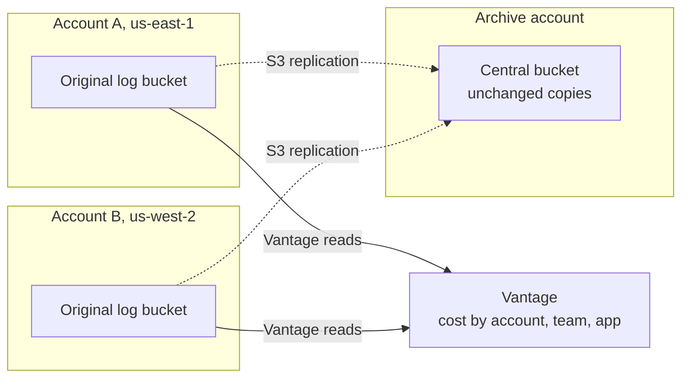
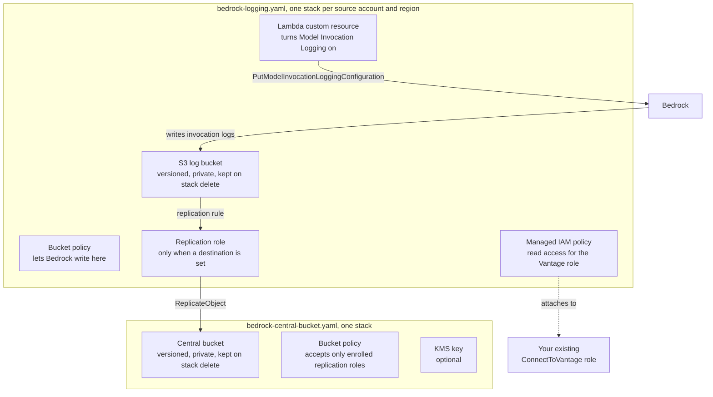
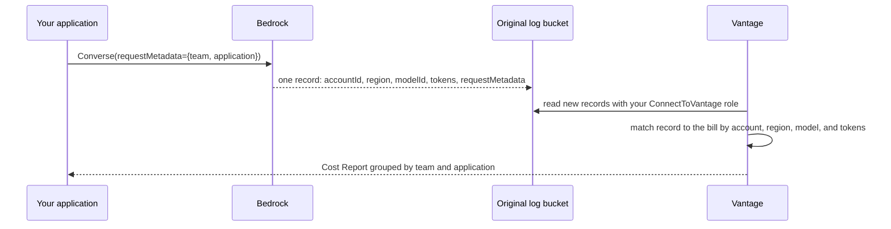
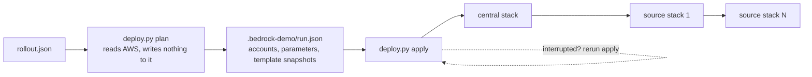
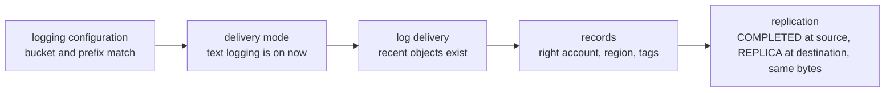
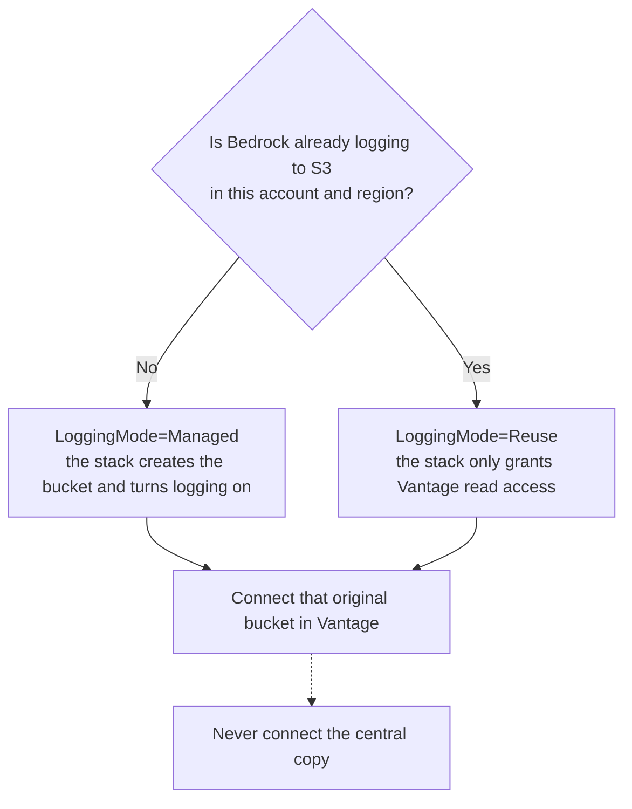

# Bedrock cost attribution with a central log archive

Your AWS bill says what Bedrock cost per account. It does not say which team, application, or environment spent it. Getting that split needs three things: Bedrock's [Model Invocation Logs](https://docs.aws.amazon.com/bedrock/latest/userguide/model-invocation-logging.html) turned on in every account and region that calls a model, Vantage reading those logs next to your bill, and your own code tagging each request. This directory does the AWS side with CloudFormation and four small Python commands, and adds one thing the bill never gives you: an unchanged copy of every log in a central bucket you own, for archive and your own analytics.

One rule shapes everything here. **Vantage reads the original bucket in each account and region.** The central copy is for you. Connecting the copy to Vantage does not work, because Vantage checks that the bucket you connect is the one Bedrock is configured to write to in that account.



Follow the three numbered steps for a fresh account. Already logging Bedrock to S3? Jump to [reusing an existing bucket](#reuse-an-existing-log-bucket). [What has been proven](#what-has-been-proven-so-far) is honest about which parts have run for real.

## What one deployment creates

Each source account and region gets one stack from `bedrock-logging.yaml`. The archive gets one stack from `bedrock-central-bucket.yaml`. The wrapper script deploys the central stack first because the source stacks need its outputs.



The Lambda exists because CloudFormation has no resource for Bedrock's logging setting. It is deliberately cautious: it turns logging on only when nothing is configured, it never overwrites a configuration that points somewhere else, and on stack delete it leaves logging on unless you explicitly ask otherwise. The whole decision table is pure Python in `bedrock_demo/core/lifecycle.py`, and the tests in `tests/test_lifecycle.py` walk every branch.

## How a tagged request becomes a cost line

Nothing in this directory rewrites a log. Bedrock writes native JSON with the calling account, the region, token counts, and whatever `requestMetadata` your code attached. Vantage reads that record and matches it to the bill row for the same account, region, and model, then splits that row's cost across the tags by token share.



Two consequences worth knowing before you deploy. The `accountId` inside the record decides which account gets the cost, so several accounts can share one payer integration and still be attributed separately. And the `region` inside the record is where the call was made, which can differ from where an inference profile ran the model. The verifier checks both fields against the bucket they landed in, so a record in the wrong place fails loudly rather than being attributed to the wrong account.

## Before you start

- Each source account is [connected to Vantage](https://docs.vantage.sh/connecting_aws) with an active cross-account role, and its billing arrives through its own or its payer's integration.
- You have AWS profiles that can deploy in each source account and in the archive account, plus Vantage Organization Owner or Integration Owner access.
- The Vantage role has room for one more managed policy attachment per source stack. Check [policy capacity](#check-vantage-policy-capacity) before a multi-region rollout.
- Python 3.10 or newer and the AWS CLI are installed. Run every command from this directory.

Raw invocation logs can include prompts and responses. Pick the archive's region, access, and retention with that in mind. Replication adds storage and request charges, plus transfer charges across regions, and retention defaults to keeping everything.

## 1. Deploy the buckets and permissions

```bash
python3 -m pip install boto3
cp examples/rollout.json rollout.json
```

Edit `rollout.json`. Replace the profiles, account IDs, regions, bucket names, and each source's `vantage_role` with the name of its active `ConnectToVantage` role. Set `retention_days` on both sides. I'd start with one source account and one region, then add the rest once you have seen a tagged request land.



```bash
python3 deploy.py plan --config rollout.json --manifest .bedrock-demo/run.json
```

Planning checks that each profile is signed into the account it claims, that no stack or Bedrock logging configuration already exists where a source stack would go, and that AWS accepts the templates. It refuses to adopt anything that exists. Read the printed targets, then apply:

```bash
python3 deploy.py apply --manifest .bedrock-demo/run.json
```

Apply saves progress after every observed stack transition, so an interrupted run resumes from the same command. The manifest carries snapshots of the exact templates it planned with; a changed checkout cannot slip into a resume. It also refuses to touch a stack it did not create, which it tells apart by tags on the stack. To change a deployed stack later, use a normal reviewed CloudFormation update, not this wrapper.

## 2. Send a tagged request and verify the logs

Add `requestMetadata` to the Bedrock calls in your application. Vantage keeps your tag keys exactly as sent, so `team` shows up as `team`.

```python
bedrock.converse(
    modelId=model_id,
    messages=messages,
    requestMetadata={"team": "growth", "application": "checkout", "environment": "prod"},
)
```

`ConverseStream` takes the same field. `InvokeModel` and its streaming variant use the `X-Amzn-Bedrock-Request-Metadata` header, which must be included in SigV4 signing. SDKs that expose a metadata parameter handle signing for you. AWS allows up to 16 pairs of 256 characters each; see [request metadata](https://docs.aws.amazon.com/bedrock/latest/userguide/cost-mgmt-request-metadata.html). Put the tags on a shared client rather than hoping every caller remembers, and keep the values low-cardinality: team, application, environment, never a user ID or timestamp.

For a controlled first test, `smoke.py` makes exactly one billed request capped at 16 output tokens. It refuses to run if the AWS profile is signed into a different account than you named, and it writes its intent to disk before calling so that an uncertain network response can never trigger a second billed call.

```bash
AWS_PROFILE=source-admin python3 smoke.py \
  --account-id 222222222222 --region us-west-2 \
  --model-id us.amazon.nova-micro-v1:0 \
  --tag team=growth --tag application=checkout \
  --output .bedrock-demo/invocation.json
```

Pick a model you have enabled and check its price first. The receipt records the request ID and token counts, nothing from the prompt or response. A later run with the same output path is refused.

Logs appear a few minutes after the call. Then verify each source with the values from your manifest:

```bash
AWS_PROFILE=source-admin python3 verify.py \
  --region us-west-2 --bucket replace-with-your-source-bedrock-bucket \
  --destination-bucket replace-with-your-central-bedrock-bucket \
  --destination-region us-east-1 --destination-profile central-admin \
  --expect-tag team=growth --expect-tag application=checkout \
  --json-output .bedrock-demo/verification.json
```



The checks run in that order and the exit code is nonzero if any of them is not a pass. A quiet account shows up as pending, not failed, with a hint to widen `--days`. Add `--key-prefix` if you set one, `--sample` to read more than the newest three objects, and `--delivery-type` for image, embedding, video, or audio workloads. A manual copy into the central bucket does not pass: the verifier requires S3's own replication status on both sides and byte-identical objects.

Everything verify.py proves, it proves with your AWS credentials. Its JSON report always records `vantage_verified: false`, because whether Vantage's role can read the bucket and whether costs actually get tagged is settled in step 3, not here.

## 3. Connect the original buckets in Vantage



1. Open [Settings → Integrations → AWS Bedrock](https://console.vantage.sh/settings/bedrock_model_invocation_logs) and select each original source bucket, one per account and region. Leave the central bucket out.
2. Run **Check Permissions**, fix anything it reports, then **Connect**. This is the check that uses Vantage's real role; nothing in this directory can stand in for it. A new bucket can take up to 24 hours to appear in the list.
3. After the next AWS billing import, open **View import history**. `Added` only means the connection was saved. Wait for a run with a billing period and read its log, token, and bill-match metrics, explained in the [import history guide](https://docs.vantage.sh/llm_enrichment_import_history).
4. Group a Cost Report by AWS account and by your `team` tag. The test account should show its own tags on its own billed cost. That report is the evidence that the whole chain works; keep it with the AWS report from step 2.

Connecting does not trigger an import and does not reprocess old months. Enrichment rides along with the regular billing refresh, and recent days are reworked within a short rolling window, per [data freshness and backfill](https://docs.vantage.sh/aws_bedrock_enrichment#data-freshness-and-backfill). Logs from before logging was on cannot be recovered. And do not feed the same requests through both this native integration and a Custom LLM source, or they count twice.

## Reuse an existing log bucket

If an account already logs Bedrock to S3, deploy the source template directly in `Reuse` mode. It validates that logging points at the bucket and prefix you name, grants Vantage read access, and changes nothing else: CloudWatch destinations, delivery types, bucket policy, encryption, and retention all stay with whoever owns them.

```bash
AWS_PROFILE=source-admin aws cloudformation deploy \
  --stack-name bedrock-log-access --region us-west-2 \
  --template-file bedrock-logging.yaml \
  --capabilities CAPABILITY_NAMED_IAM \
  --parameter-overrides \
    LoggingMode=Reuse \
    ExistingLogBucket=replace-with-your-existing-log-bucket \
    KeyPrefix= \
    VantageCrossAccountRole=REPLACE_WITH_EXISTING_VANTAGE_ROLE_NAME
```

A different configured destination fails the deploy instead of being replaced. Reuse never adds replication; if you want the existing bucket copied to the archive, add the rule in the bucket's own CloudFormation or Terraform.

### Check Vantage policy capacity

Each source stack attaches one customer-managed policy to the Vantage role. I chose a managed policy over an inline one because the role's inline policies share a 10,240-byte budget that a multi-region rollout ran into during testing. Managed attachments have their own quota, so count before you deploy:

```bash
AWS_PROFILE=source-admin aws iam get-account-summary --query SummaryMap.AttachedPoliciesPerRoleQuota
AWS_PROFILE=source-admin aws iam list-attached-role-policies --role-name YOUR_ACTIVE_VANTAGE_ROLE
```

If the role is full, ask its owner for a quota increase or consolidation. When several `ConnectToVantage` roles exist, the stack refuses to guess and asks you to name the active one.

An older deployment of this demo used an inline policy named `VantageReadPolicy`. Upgrade it in two reviewed updates: add the managed policy while the inline one still exists, confirm Vantage still passes Check Permissions, then remove the inline one. The deploy wrapper does not do this for you.

## Expand the rollout

Put every intended source account and region in `rollout.json` before the first plan. Adding a source to an existing plan is not supported; deploy new source stacks with CloudFormation and, if the central bucket policy lists accounts explicitly, update that list first.

For an organization, service-managed StackSets require trusted access to AWS Organizations. `preflight.py` runs from the management account, reads recent Bedrock spend from Cost Explorer, names the accounts from Organizations, and prints StackSet commands:

```bash
python3 preflight.py --mode fixed
# Or enroll an organizational unit, including accounts that join it later:
python3 preflight.py --mode ou --ou-id ou-example-00000000
```

| Mode | Covers | Later |
| --- | --- | --- |
| `fixed` | Only the accounts and regions where spend showed | New accounts are not enrolled; review a new plan and update the existing StackSet when scope changes |
| `ou` | Every account in the OU, in the regions you list | StackSets deploys to accounts that join the OU; new regions still need a scope change |

The region list comes from observed spend, so add regions you intend to use. Service-managed StackSets skip the management account; deploy its stack separately if it calls Bedrock. StackSet operations run one at a time, so wait for each to finish. And each newly enrolled account still needs its own Vantage integration and its own bucket connected in step 3.

<details>
<summary>Use the templates directly, with replication and KMS</summary>

`bedrock-logging.yaml` deploys on its own when you only want logging and Vantage access. For replication, deploy `bedrock-central-bucket.yaml` first with `CentralBucketName` and either `SourceAccountIds` or `SourceOrganizationId`, then pass its outputs to every source stack as `ReplicationDestinationBucketArn` and `ReplicationDestinationAccountId`. Keep `ReplicationRoleNamePrefix` identical on both sides; the central bucket policy admits only roles with that prefix.

Replication copies eligible new objects with their keys and bytes unchanged. Objects that existed before the rule need [S3 Batch Replication](https://docs.aws.amazon.com/AmazonS3/latest/userguide/s3-batch-replication-batch.html), and copying them does not make Vantage reprocess anything.

Fresh buckets use SSE-S3. For KMS, both sides must agree: set `central.kms=true` and a `kms_key_arn` on every source in `rollout.json`, or with the raw templates set `EnableKmsEncryption` on the destination plus `LogKmsKeyArn` and `ReplicationDestinationKmsKeyArn` on each source. A KMS default on the destination alone does not convert SSE-S3 replicas. Your source key policies must allow Bedrock delivery, the replication role, and the Vantage role to use the key; an IAM grant does not override a key policy.

`LogRetentionDays` and `RetentionDays` default to `0`, which means never expire. Versioning keeps older object versions too. Replication Time Control is not enabled.

</details>

## If a step is stuck

| Symptom | What to check |
| --- | --- |
| No source logs | Account, region, prefix, and that the delivery type you use is on. Send a tagged request or widen `--days`. |
| Replica missing | Replication status on the source object, versioning on both buckets, the destination bucket policy, and KMS grants. Pending copies finish on their own; failed ones need a fix and a Batch Replication run. |
| Vantage Check Permissions fails | The Vantage role's read access on the original bucket, and KMS access if the bucket is encrypted. Your own profile passing verify.py says nothing about Vantage's role. |
| Source stays at `Added` | Wait for the next billing import. **Run Checks** validates permissions; it does not import. |
| Imported logs, costs still untagged | The billing period has arrived, the calls actually carried `requestMetadata`, and Import History's exclusion reasons. |

## Remove only what this deployment owns

Deleting a stack keeps its bucket, its data, its delivery policy, and its replication role. Managed logging stays on by default. What a delete does remove is the stack's read grant for Vantage, so stop or replace that source in Vantage first.

1. Decide whether logging should continue. If it should stop, do that through whichever tool owns it. For logging this stack created and never changed, a reviewed update to `RetainLoggingOnDelete=false` lets the delete turn it off. Reused logging is never turned off by this stack.
2. Disable the replication rule when you no longer want copies.
3. Delete the stacks, then look at what was retained: buckets with their versions and delete markers, bucket policies, the named replication role, the KMS key, and the Lambda log groups. Keep the KMS key as long as encrypted logs exist.

## What Vantage needs from these logs

Everything above rests on a short contract with the public Vantage integration. This table is what the templates and verifier protect, with the public documentation for each point.

| Vantage needs | How this demo keeps it |
| --- | --- |
| The connected bucket is the one Bedrock is configured to write to in that account and region ([integration docs](https://docs.vantage.sh/aws_bedrock_enrichment)) | Managed mode configures logging to the new bucket; Reuse mode refuses a bucket that is not the configured destination; the central copy is never offered as a source |
| Records under `<prefix>/AWSLogs/<account>/BedrockModelInvocationLogs/<region>/` | Policies and replication cover the native Bedrock prefix; `verify.py` checks the original account/region path |
| Native JSON with `accountId`, `region`, `modelId`, token counts, and `requestMetadata` | Nothing rewrites objects; replication copies bytes, and the verifier compares them |
| Your tag keys as sent | No prefixing, no renaming; grouping by `team` in a Cost Report works as is |
| Billing for the account in Vantage, through its own or its payer's integration | A prerequisite, not something the templates can create |
| Connect and import as separate steps ([import history](https://docs.vantage.sh/llm_enrichment_import_history)) | The AWS report always leaves `vantage_verified: false`; save Vantage import and cost evidence separately |

## What has been proven so far

As of September 14, 2026, 107 automated checks pass. A one-account test proved native log delivery and cross-region replication with identical bytes and metadata. A separate Reuse test preserved existing logging, passed Vantage Check Permissions, and connected successfully.

Full end-to-end cost attribution remains unverified. The new source awaits Vantage inventory; the Reuse source shows `Added`, awaiting billing import. Cross-account, organization, and KMS validation remain open. Only one test account was available for this run.

## Maintain and validate the demo

| Location | Purpose |
| --- | --- |
| `deploy.py`, `preflight.py`, `smoke.py`, `verify.py` | The four commands; each is a thin entry point for `bedrock_demo/cli/` |
| `bedrock_demo/core/` | Pure decisions: config validation, logging ownership, planning, verification. Testable with literals |
| `bedrock_demo/aws/` | AWS discovery, deployment, and verification operations |
| `bedrock_demo/lambda_handlers/` | The two custom-resource handlers, inlined into the template by `render_templates.py` |
| `templates/` | Sources for the two deployable YAML files; edit these, not the rendered files |
| `tests/`, `test_bedrock.py` | Stubbed-AWS and pure tests; nothing here creates resources or bills a model |

After editing a template source or a Lambda handler, run `python3 render_templates.py` to regenerate the YAML. Then:

```bash
python3 -m pip install boto3 -r requirements-dev.txt
python3 render_templates.py --check
python3 test_bedrock.py
python3 -m unittest discover -s tests -v
git diff --check
```

For a live acceptance run, keep the manifest, the smoke receipt, the matching native log object, the verifier's JSON report, the Vantage import run, and the tagged Cost Report together, in a private place. Two source accounts in two regions with the archive in a third account is the test that exercises cross-account permissions; a single account only proves the mechanics.
